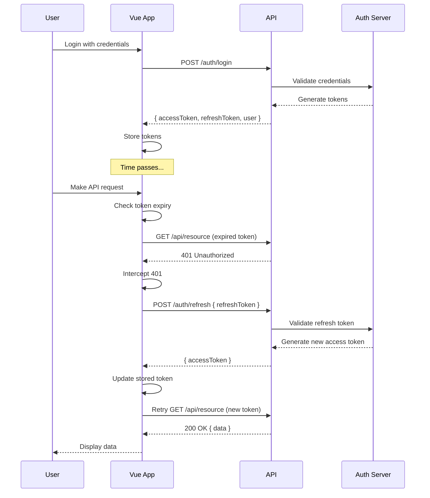

## Purpose of Refresh Tokens

### **The Problem:**
- JWT access tokens contain user info and permissions
- If compromised, attackers can impersonate users
- Long-lived tokens = bigger security risk
- Short-lived tokens = users must login frequently (poor UX)

### **The Solution:**
- **Access Token**: Short-lived (5-15 minutes), used for API requests
- **Refresh Token**: Long-lived (7-30 days), used only to get new access tokens
- Best of both worlds: security + user experience

## How Token Refresh Works

Here's the complete flow:



## Implementation Details

### **Token Storage Structure**
```javascript
// What gets stored after login
{
  accessToken: "eyJhbGciOiJIUzI1NiIs...", // JWT, expires in 15 min
  refreshToken: "550e8400-e29b-41d4-a716...", // UUID, expires in 7 days
  user: { id: 1, email: "user@example.com", ... }
}
```

### **Token Lifecycle in Vue App**

```javascript
// === 1. Initial Login Flow ===
// User submits login form
const login = async (credentials) => {
  const response = await fetch('/api/auth/login', {
    method: 'POST',
    body: JSON.stringify(credentials)
  });
  
  const data = await response.json();
  // Returns:
  // {
  //   accessToken: "eyJhbGciOiJIUzI1NiIs...",  // 15 min expiry
  //   refreshToken: "550e8400-e29b-41d4...",    // 7 day expiry
  //   user: { id: 1, email: "user@example.com" }
  // }
  
  // Store tokens
  localStorage.setItem('accessToken', data.accessToken);
  localStorage.setItem('refreshToken', data.refreshToken);
  
  return data;
};

// === 2. Making Authenticated Requests ===
// Every API request includes the access token
const makeApiRequest = async (url) => {
  const accessToken = localStorage.getItem('accessToken');
  
  const response = await fetch(url, {
    headers: {
      'Authorization': `Bearer ${accessToken}`
    }
  });
  
  return response;
};

// === 3. Token Expiry Detection ===
// Check if token is expired before making request
const isTokenExpired = (token) => {
  try {
    const payload = JSON.parse(atob(token.split('.')[1]));
    const expiry = payload.exp * 1000; // Convert to milliseconds
    return Date.now() > expiry;
  } catch {
    return true;
  }
};

// === 4. Automatic Token Refresh ===
// HTTP Interceptor implementation
const httpInterceptor = {
  async request(config) {
    const accessToken = localStorage.getItem('accessToken');
    
    // Check if token exists and is expired
    if (accessToken && isTokenExpired(accessToken)) {
      // Try to refresh before making the request
      await refreshAccessToken();
    }
    
    // Add current token to request
    if (accessToken) {
      config.headers.Authorization = `Bearer ${accessToken}`;
    }
    
    return config;
  },
  
  async responseError(error) {
    const originalRequest = error.config;
    
    // If 401 and haven't already tried to refresh
    if (error.response?.status === 401 && !originalRequest._retry) {
      originalRequest._retry = true;
      
      try {
        // Attempt to refresh the token
        await refreshAccessToken();
        
        // Retry the original request with new token
        const newToken = localStorage.getItem('accessToken');
        originalRequest.headers.Authorization = `Bearer ${newToken}`;
        
        return fetch(originalRequest.url, originalRequest);
      } catch (refreshError) {
        // Refresh failed, redirect to login
        redirectToLogin();
        throw refreshError;
      }
    }
    
    throw error;
  }
};

// === 5. The Refresh Process ===
const refreshAccessToken = async () => {
  const refreshToken = localStorage.getItem('refreshToken');
  
  if (!refreshToken) {
    throw new Error('No refresh token available');
  }
  
  const response = await fetch('/api/auth/refresh', {
    method: 'POST',
    headers: { 'Content-Type': 'application/json' },
    body: JSON.stringify({ refreshToken })
  });
  
  if (!response.ok) {
    // Refresh token is invalid or expired
    clearAuthData();
    throw new Error('Refresh failed');
  }
  
  const data = await response.json();
  // Returns: { accessToken: "new-jwt-token..." }
  
  // Update stored access token
  localStorage.setItem('accessToken', data.accessToken);
  
  return data.accessToken;
};

// === 6. Complete Auth Flow Example ===
class AuthManager {
  constructor() {
    this.refreshPromise = null;
  }
  
  async makeAuthenticatedRequest(url, options = {}) {
    // Step 1: Check if token needs refresh
    const accessToken = this.getAccessToken();
    
    if (this.isTokenExpired(accessToken)) {
      // Step 2: Refresh if needed (singleton pattern to prevent multiple refreshes)
      if (!this.refreshPromise) {
        this.refreshPromise = this.refreshToken();
      }
      
      try {
        await this.refreshPromise;
      } finally {
        this.refreshPromise = null;
      }
    }
    
    // Step 3: Make the request
    const response = await fetch(url, {
      ...options,
      headers: {
        ...options.headers,
        'Authorization': `Bearer ${this.getAccessToken()}`
      }
    });
    
    // Step 4: Handle 401 (token expired during request)
    if (response.status === 401 && !options._retry) {
      options._retry = true;
      
      // Try one more refresh
      await this.refreshToken();
      
      // Retry the request
      return this.makeAuthenticatedRequest(url, options);
    }
    
    return response;
  }
  
  async refreshToken() {
    const refreshToken = this.getRefreshToken();
    
    const response = await fetch('/api/auth/refresh', {
      method: 'POST',
      headers: { 'Content-Type': 'application/json' },
      body: JSON.stringify({ refreshToken })
    });
    
    if (!response.ok) {
      // Refresh failed - user must login again
      this.logout();
      throw new Error('Session expired');
    }
    
    const { accessToken } = await response.json();
    this.setAccessToken(accessToken);
    
    return accessToken;
  }
  
  // Helper methods
  getAccessToken() {
    return localStorage.getItem('accessToken');
  }
  
  getRefreshToken() {
    return localStorage.getItem('refreshToken');
  }
  
  setAccessToken(token) {
    localStorage.setItem('accessToken', token);
  }
  
  isTokenExpired(token) {
    if (!token) return true;
    
    try {
      const payload = JSON.parse(atob(token.split('.')[1]));
      return Date.now() >= payload.exp * 1000;
    } catch {
      return true;
    }
  }
  
  logout() {
    localStorage.removeItem('accessToken');
    localStorage.removeItem('refreshToken');
    window.location.href = '/login';
  }
}
```

#### **1. Token Security**
```javascript
// Access Token (JWT)
{
  "sub": "user123",
  "email": "user@example.com",
  "exp": 1234567890,  // Expires in 15 minutes
  "iat": 1234567890
}

// Refresh Token (Opaque)
"550e8400-e29b-41d4-a716-446655440000"  // Random UUID, no user data
```

#### **2. Storage Considerations**
- **Access Token**: Can be in memory or localStorage (short-lived)
- **Refresh Token**: Should be httpOnly cookie (most secure) or localStorage
- **Never store in**: Regular cookies, sessionStorage, or code

#### **3. Backend Implementation**
```javascript
// Express.js example
app.post('/auth/refresh', async (req, res) => {
  const { refreshToken } = req.body;
  
  // Verify refresh token exists in database
  const tokenRecord = await db.refreshTokens.findOne({ 
    token: refreshToken,
    expiresAt: { $gt: new Date() }
  });
  
  if (!tokenRecord) {
    return res.status(401).json({ error: 'Invalid refresh token' });
  }
  
  // Generate new access token
  const accessToken = jwt.sign(
    { sub: tokenRecord.userId, email: tokenRecord.email },
    process.env.JWT_SECRET,
    { expiresIn: '15m' }
  );
  
  res.json({ accessToken });
});
```

## Benefits of This Approach

1. **Security**
   - Short-lived access tokens minimize damage if compromised
   - Refresh tokens can be revoked instantly (logout all devices)
   - No need to store sensitive data in long-lived tokens

2. **User Experience**
   - Users stay logged in for days/weeks
   - Seamless token refresh (no interruption)
   - No unexpected logouts during work

3. **Control**
   - Can implement "remember me" (longer refresh token)
   - Can force re-authentication for sensitive operations
   - Can track active sessions per user

## Common Pitfalls to Avoid

1. **Don't refresh too early**
   ```javascript
   // Bad: Refreshing on every request
   if (tokenExpiresIn < 86400) { // 24 hours
     await refresh();
   }
   
   // Good: Refresh only when needed
   if (tokenExpiresIn < 300) { // 5 minutes
     await refresh();
   }
   ```

2. **Handle race conditions**
   ```javascript
   // Prevent multiple simultaneous refresh attempts
   let refreshPromise = null;
   
   async function ensureValidToken() {
     if (!refreshPromise && isTokenExpired()) {
       refreshPromise = refreshToken();
     }
     
     if (refreshPromise) {
       await refreshPromise;
       refreshPromise = null;
     }
   }
   ```

3. **Don't create refresh loops**
   ```javascript
   // Add retry limit
   if (error.response?.status === 401 && retryCount < 1) {
     // Try refresh once
   } else {
     // Give up and redirect to login
   }
   ```

## Complete Data Flow Visualization

```
1. LOGIN
   Vue → API: { email, password }
   API → Vue: { accessToken (15min), refreshToken (7days), user }
   Vue: Store all tokens

2. NORMAL REQUEST
   Vue: Check token expiry → Still valid
   Vue → API: Request + Bearer accessToken
   API → Vue: 200 OK + Data

3. EXPIRED TOKEN REQUEST
   Vue: Check token expiry → Expired!
   Vue → API: POST /refresh { refreshToken }
   API → Vue: { accessToken (new) }
   Vue: Update stored token
   Vue → API: Original request + new Bearer token
   API → Vue: 200 OK + Data

4. REFRESH TOKEN EXPIRED
   Vue → API: POST /refresh { refreshToken }
   API → Vue: 401 Unauthorized
   Vue: Clear all auth data
   Vue: Redirect to /login
```

This system ensures your users have a smooth experience while maintaining high security standards. The key is that refresh happens automatically and invisibly to the user!